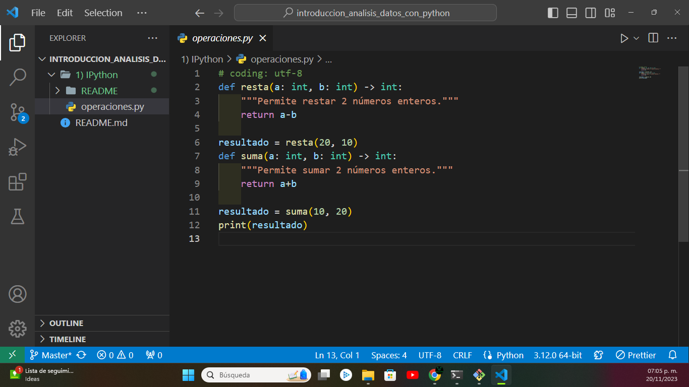
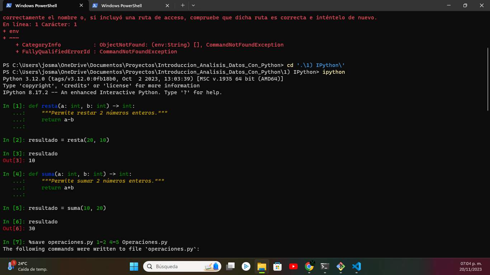
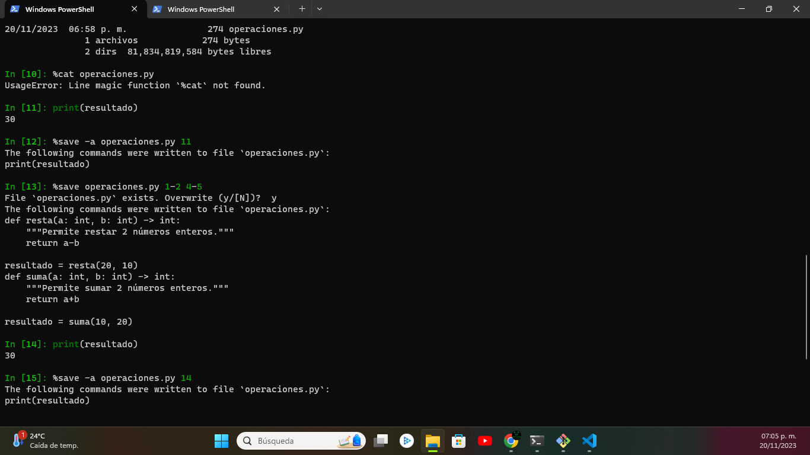

# Presentación

El siguiente repositorio abarca el **diseño, consultas** de una base de datos para la empresa 'LuGas', especializada en gasolineras.

<h1 align="center"> Diseño y desarrollo de base de datos para "LuGas" </h1>

 Pantalla principal de creacion de base de datos 

# Tabla de contenidos:

---

- [Regresar al inicio](#presentación)
